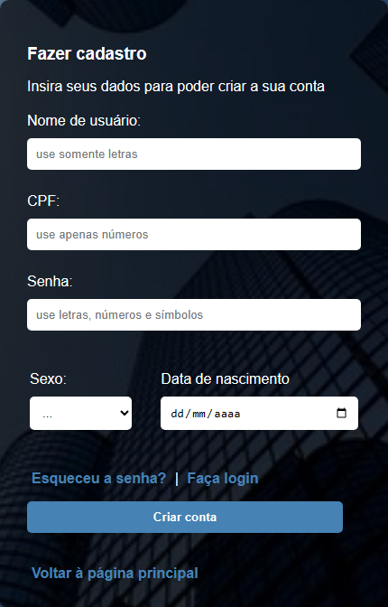
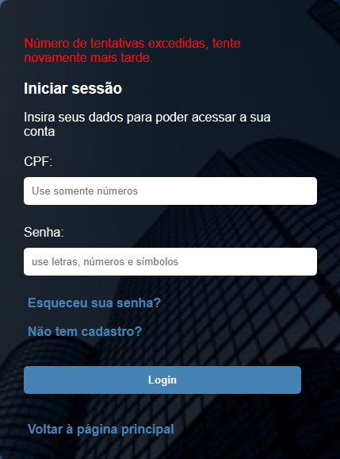

# Sistema de Cadastro com PHP e Banco de Dados

Um sistema de gerenciamento de usuário desenvolvido com `HTML`, `CSS`, `PHP` e `MySQL`, que permite cadastro, login, atualização de senha, edição e exclusão de conta.

A web-based user management system developed with `HTML`, `CSS`, `PHP`, and `MySQL`, allowing user registration, authentication, profile editing, and account management.


## Características
- Cadastro de usuário com validação
- Sistema de login seguro
- Redefinição de senha
- Atualização de perfil
- Exclusão de conta
- Autenticação baseada em sessão

## Tecnologias Utilizadas

Abaixo estão as principais tecnologias utilizadas no desenvolvimento do projeto:

| Tecnologia |  Motivo da utilização |
|------------|-----------------------|
| HTML | Criação da interface gráfica para o usuário poder utilizar o sistema |
| CSS | Fazer a interface ser mais amigável com o usuário, melhorando a visualização como um todo |
|PHP | Utilizada para fazer o tratamento de informações do usuário e conexão com a base de dados onde essas informações ficarão armazenadas |
| SQL | Utilizado em queries preparadas (prepared statements) para inserção, edição, atualização ou exclusão do banco de dados |


## Estrutura do Projeto

Abaixo está a estrutura geral que o projeto segue

(Observação: nem todos os arquivos estão listados, aqui é somente um modelo da estrutura de diretórios)
```bash
./
├── functions/ # Funções reutilizáveis e lógica de backend
│  ├── config.php # Configuração de conexão com o banco de dados
│  ├── README.md # Documento de funções
│  └── ...
│
├── styles/ # Arquivos de estilo (CSS)
│  ├── main.css # Arquivo de estilo da página principal
│  ├── README.md # Documento de estilos
│  └── ...
│
├── images/ # Imagens usadas nas páginas
│  ├── Dashboard.png
│  └── ...
│
├── docs/ # images e arquivos relacionados ao README pricipal
│  └── ...
│ 
├── pagina_principal.php # Página principal do projeto
└── README.md # Documentação principal do projeto
```

## Como funciona o fluxo do projeto

### Autenticação / Login

1. Usuário insere CPF e senha
2. O sistema busca essas informações na base de dados
3. A senha é validada
4. Sessão é iniciada

### Cadastro

1. Usuário insere nome, CPF, senha, sexo e data de nascimento
2. Backend valida essas informações
3. A senha é armazenada utilizando hash
4. Informações são inseridas na base de dados
5. Conta é criada

### Atualização da conta

1. Usuário atualiza suas informações
2. Backend valida as novas informações
3. Informações são atualizadas na base de dados
4. Conta é atualizada

### Exclusão da conta

1. Usuário solicita exclusão da conta
2. Confirma exclusão por senha
3. Backend valida a senha
4. Informações do usuário são apagadas da base de dados
5. Conta é excluída

## Segurança

O sistema implementa alguns mecanismos de segurança visando manter a integridade dos dados e evitar falhas.

Alguns desses mecanismos:

| Mecanismo | Falha de segurança evitada | Função |
|-----------|----------------------------|--------|
| Prepared Statements | SQL Injection | Evitar que usuários mal-intencionados tentem inserir algum comando em SQL nos campos de formulário
| Hash de senha | Senha salva em texto puro | Gera um hash da senha para que a senha não seja salva em texto puro |
| Validação dos Dados | Dados 'sujos' | Evitar que dados danosos e/ou incorretos sejam enviados para o banco de dados |
| Sessões PHP e regeneração de ID | Roubo de Sessão | Evitar que o usuário possa ter sua sessão comprometida, gerando um novo ID a cada início de sessão |
| htmlspecialchars() | Cross-site Scripting | Evita que códigos HTML ou JavaScript inseridos pelo usuário sejam interpretados pelo navegador |

A proteção contra CSRF (uso de tokens para validação de requisições) não foi implementada neste projeto.


## Imagens do Projeto

Algumas Imagens do projeto em funcionamento

### Cadastro
Página de cadastro de novos usuários.



### Dashboard após login
Área principal após autenticação do usuário.


### Erro de login (excesso de tentativas)
Mensagem exibida quando o limite de tentativas é atingido.



### Aviso de êxito ao criar conta
Mensagem exibida após criação da conta.


## Objetivo de Aprendizado

Este projeto foi desenvolvido com o objetivo de praticar:

- Lógica de backend com PHP
- Manipulação de formulários
- Integração com banco de dados (MySQL)
- Gerenciamento de sessões
- Organização de código
- Medidas básicas de segurança (SQL Injection, XSS, etc.)


## Autor
- Rodrigo de Souza Galvão 
- Perfil Github: https://github.com/Rodrigo3441
- Email: rsgrodrigo77@gmail.com
- LinkedIn: https://www.linkedin.com/in/rodrigo-souza-galvao/

